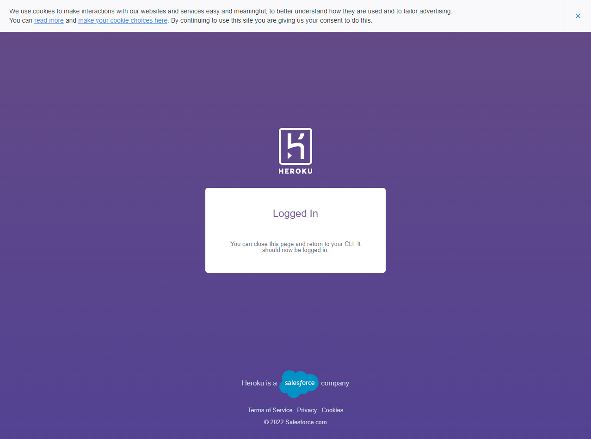
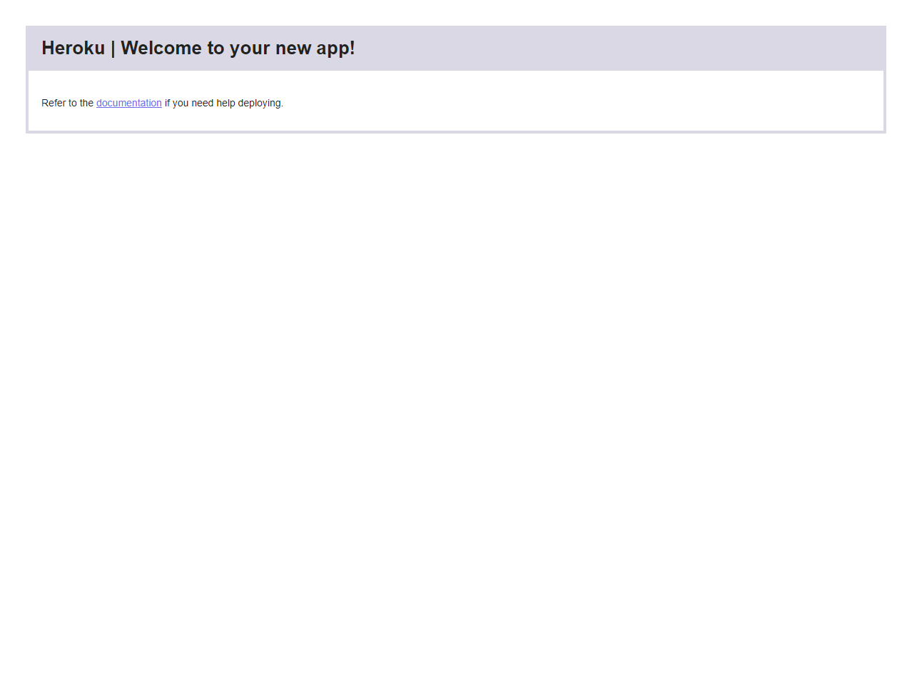
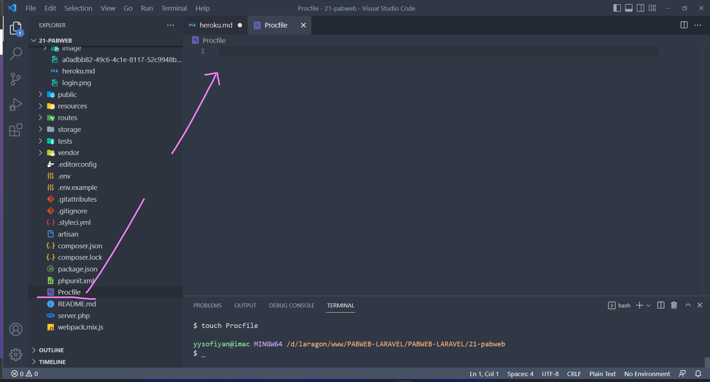
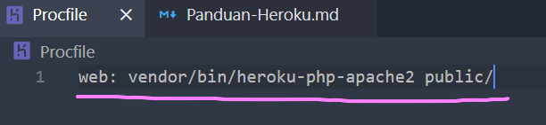

# Login ke Heroku CLI

Sebelum masuk ke tahap ini pastikan aplikasi berada dalam direktori & `heroku CLI` sudah diinstall.

* Masuk ke terminal / command prompt pada folder aplikasi, kemudian jalankan perintah :

`$ heroku login`

Heroku akan mengarahkan kita untuk login via browser.

Setelah berhasil, pada terminal akan menampilkan email kita, seperti output pada terminal berikut:

```bash
heroku: Press any key to open up the browser to login or q to exit:
Opening browser to https://cli-auth.heroku.com/auth/cli/browser/c57590ec-7f1b-45d5-9a2e-16aa9f2c8680?requestor=SFMyNTY.g2gDbQAAAA8xMDMuMTQ0LjE3NS4yMzBuBgAQPdZlhAFiAAFRgA.vICSJphBLdfnNdXAi8VjVQBmmQ5OJk9Ka-gwDvPJePM
Logging in... done
Logged in as aninomus.ani@gmail.com
```

*heroku cli login berhasil ☝🏻*

## Mendaftarkan Aplikasi di Heroku

Aplikasi yang telah kita buat, perlu didaftarkan terlebih dahulu dengan menjalankan perintah :

```bash
heroku create nama-aplikasi-kita
```

Ketika pendaftaran aplikasi berhasil, maka kita sudah bisa mengakses aplikasi kita, walau masih belum ada isinya.

```bash
yysofiyan@imac MINGW64 /d/laragon/www/PABWEB-LARAVEL/PABWEB-LARAVEL/21-pabweb
$ heroku create laravellia
Creating ⬢ laravellia... done
https://laravellia.herokuapp.com/ | https://git.heroku.com/laravellia.git
```



heroku create berhasil ☝🏻

# Menambahkan Procfile

Buat file yang bernama `Procfile `dengan cara ketik perintah berikut di terminal didalam folder project Laravel kita.

```bash
touch Procfile
```



Setelah itu isi Procfile seperti ini:

```php
web: vendor/bin/heroku-php-apache2 public/
```



**Selanjutnya, inisiasi git dulu didalam folder project (ini bisa *connect* ke github kita juga lho). 😍**

## Initialize Git repo

Jalankan command berikut untuk inisiasi git repo dari terminal *-git remote nya url ke repo masing2 ya.* 🥳

```bash
git init
git add README.md
git commit -m "first commit"
git branch -M main
git remote add origin https://github.com/autobot-byte/laravellia.git
git push -u origin main
```
